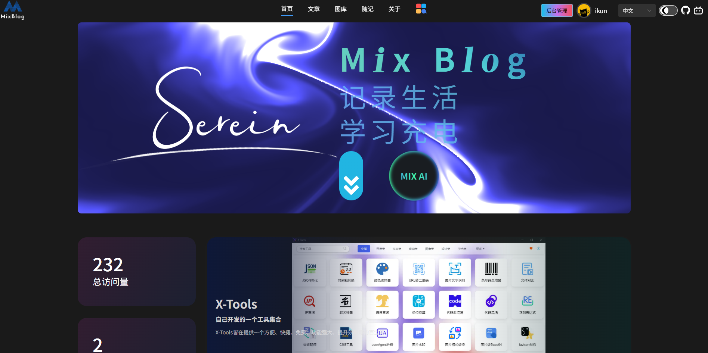

<h3>🎉🎉🎉 X-Tools v1.0.0 has been released! 🎉🎉🎉</h3>

 

 

<h3><strong>Description: Developed based on the electron-egg framework, the front-end project is built on Vue 3.0.</strong></h3>

 

 
 

Welcome to visit my blog：https://mixblog.cn/

 
 

## Environment Preparation:
node >= 20.0.0
Electron = ^31.7.6

## Start Project in Development Environment
1.Enter the frontend project directory cd .\frontend, execute npm install
2.Execute npm install in the project root directory
3.Execute npm run dev-f in the frontend directory to start the renderer process service
4.Execute npm run dev-e in the project root directory to start the main process service

## Two Packaging Methods:
1.Directly execute npm run build in the root directory (recommended). This method will encrypt the code during packaging.
2.Execute npm run build-frontend and npm run build-electron separately in the root directory. This method will not encrypt the code.

## Package Testing:
Execute npm run start in the root directory

## Build Executable Files:
1.Build Windows 64-bit version: npm run build-w
2.Build Mac version: npm run build-m
3.Build Linux version: npm run build-l
For other version builds, please check the package.json file yourself.

## Package Output Directories:
Frontend: dist directory under the frontend root directory
Electron: public/dist directory under the project root directory

## Build File Output Directory:
out directory under the project root directory