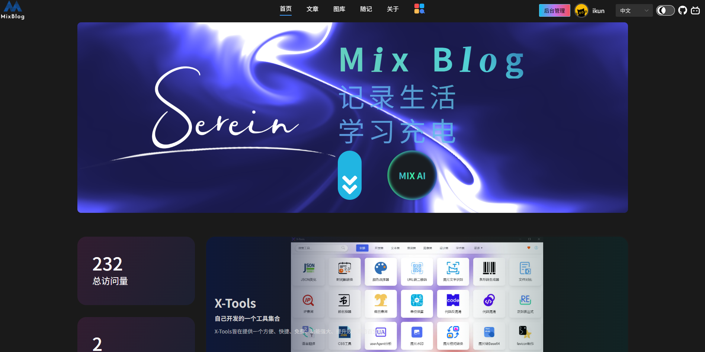

<h3>🎉🎉🎉 X-Tools v1.0.0 已经发布! 🎉🎉🎉</h3>

 

 

<h3><strong>描述：基于electron-egg框架开发，前端项目基于vue3.0开发</strong></h3>

 

 
 

欢迎您访问我的博客：https://mixblog.cn/ 

 

## 环境准备：
node >= 20.0.0
 
Electron = ^31.7.6

## 开发环境启动项目
1.进入前端项目目录 cd .\frontend ，执行npm install
 
2.项目根目录下执行 npm install
 
3.在前端目录下执行 npm run dev-f，开启渲染进程服务
 
4.在项目根目录下执行 npm run dev-e，开启主进程服务

## 两种打包方式：
1. 在根目录直接执行 npm run build（推荐），改方式打包会在打包的时候将代码加密
 
2. 在根目录下分别执行 npm run build-frontend 和 npm run build-electron，该方式打包不会加密代码
 

## 打包测试：
根目录下执行 npm run start

## 构建可执行文件：
1.构建windows 64位版本：npm run build-w
 
2.构建mac版本：npm run build-m
 
3.构建Linux版本：npm run build-l
 
其它版本构建请自行查看package.json文件

## 打包输出目录：
前端：前端根目录下的dist目录
 
electron：项目根目录下的public/dist目录

## 构建文件输出目录：
项目根目录下的out目录